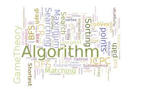
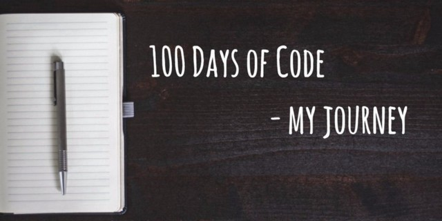

<h1 align ="center">100 Days Coding Challenge

<h3 align = "center">Coding is Fun, Code daily

<h4 align = "center">Code daily , Add your solutions to the Repo by making a pull request, you can also edit/add multiple solutions to the solved problems</h4>
 

---

### Start Coding Today !! The More you code, the more you grow
### Everyone should learn to program, because it teaches you how to think - Steve Jobs

Topic | Number of problems solved | Sources 
----- | ------------------------- | ------------------------
Arrays | 28                       | Geeks for Geeks, Techiedelight
Linked List |23                   | Geeks for Geeks, InterviewBit
Mathematical Thinking | 23        | Interview Bit, Tutorials Point
Dynamic Programming | 16          | Interview Bit, Cracking the coding Interview Book
Graphs              | 9           | Programiz, Interview Bit
Tree                | 5           | Cracking the coding Interview Book
Hackerrank 30dayschallenge | 30   | Hackerrank
NPTEL Programming In Java Assignment Solutions  | 15   | NPTEL

 

---

 

**Day 1**
1)*Tower of Hanoi*   (Referrals[https://www.geeksforgeeks.org/c-program-for-tower-of-hanoi/] ) 
2)*N-Queens Problem* (Referrals[https://www.codesdope.com/blog/article/backtracking-explanation-and-n-queens-problem/])
 

**Day 2** : 1) *Permutation of a given string* 
           2) *Permutation of a given string in lexicographical order*
  

**Day 3**: 1) *Print all possible strings of length k that can be formed from a set of n characters* 
           2) *Write a function merge_ranges() that takes a list of multiple meeting time ranges and returns a list of condensed ranges.Meeting is represented as a list having tuples in form of (start time , end time)* 

**Day 4**: 1) *Given a list of numbers(maybe positives or negatives) find triplets that equals to a desired sum*  
           2) *Given three lists of take out orders, dine in orders and served orders.You need to find whether the service is first come first served
            Problem Statement taken from : Interview Cake*
 

**Day 5**: 1) *Chain Matrix Multiplication([https://www.radford.edu/~nokie/classes/360/dp-matrix-parens.html])Go through this link for better understanding of logic working behind the scenes *
2) *Given an array of integers write a functon that returns true if there is a triplet (a, b, c) that satisfies a^2 = b^2+c^2*
 

**Day 6**: 1) *Write a function that rotates an arr[] of size n by d elements in left direction* 
2) *Write a program to print all leaders in array.An element is leader if its greater than all the elements to its right side.And the rightmost element is always a leader*
 

**Day 7**: 1) *Write a program to check whether two numbers are co-prime or not*  
2) *Some basic sorting algorithms*
 

**Day 8**:  1)*Given a binary String with wildcard characters('?') at some places.Print all the possible binary strings combinations formed by replacing wildcard characters with 0 or 1* 
2)*Print all the possible solutions of N Queens Problems*
 

**Day 9**:  1)*Python program to generate all binary strings with equal sums in left and right halves.* 
2)*Program to print all combination of size r in an array of size n*
 

**Day 10**: 1)*Power set in lexicographical order* 
2)*Taken from codechef([https://www.codechef.com/problems/LECANDY])*
 

**Day 11**: 1)*Count substrings that start and end with same letter* 
2)*Count consonants in a string**
 

**Day 12**:  1)*Solved chef and notebooks from codechef([https://www.codechef.com/problems/CNOTE])* 
2)*Swap Nodes in pairs([https://leetcode.com/problems/swap-nodes-in-pairs])*
 

**Day 13**:  1)*Quadruplets with a given sum* 
2)*Minimum number possible after k swaps*
 

**Day 14**:  1)*Kadane's algorithtm* 
2)*Given two sorted arrays X[] and Y[] of size m and n where m>=n and X[] has exactly n vacant positions, merge elements of Y[] in their correct position in array X[] i.e.merge
X[] and Y[] by maintaining the sorted order
 

---

 

**Day 15**: 1)*Linked list insertion* 
2)*Counting number of nodes in a Linked list iteratively*
 

**Day 16**1)*Deleting nodes in a linked list* 
2)*To get the Nth node in a Linked list*
 

**Day 17**1)*Counting number of times a particular node occurs in a singly linked list* 
2)*Write a program to get the Nth node from last in a singly linked list* 
3)*Function to reverse a singly linked list*
 

**Day 18**1)*Reverse Specified Portion of a Linked list* 
2)*Write a program to find the middle element of linked list*
 

**Day 19**1)*Given a singly linked list, whose nodes represent digits of a number, add a single digit number to it.* 
2)*Remove duplicates from singly linked sorted list*
 

**Day 20**1)*Given a singly linked list, check whether the linked list is palindrome or not* 
2)*Added a new file named "Algorithms", added some basics like sorting algorithms in it
 

**Day 21**1)*Doubly linked list -all methods of insertion*
 

**Day 22**1)*Insertion sort in a singly linked list* 
2)* Add two linked list without using any extra space*
 

**Day 23**1)*Removing redundant nodes in a linked list*
 

**Day 24**1)*Intersection of linked list*
 

**Day 25**1)*Seggregate even ond odd nodes in a linked list*
 

**Day 26**1)*Reordering a linked list*(https://www.interviewbit.com/problems/reorder-list/)
 

**Day 27**1)*Partitioning a given linked list(https://www.interviewbit.com/problems/partition-list/)
 

**Day 28**1)Sort Binary linked list(https://www.interviewbit.com/problems/sort-binary-linked-list/) 
2)*Prime sum*(https://www.interviewbit.com/problems/-sumprime/)
 

---

 

**Day 29**1)*Sum of pairwise hamming distances*
 

**Day 30**1)*Fizzbuzz*  (https://www.interviewbit.com/problems/fizzbuzz/)
 

**Day 31**1)*Number of length N and Value K*(https://www.interviewbit.com/problems/numbers-of-length-n-and-value-less-than-k/)
 

**Day 32**1) *A items are to be delivered in a circle of size B. 
Find the position where the Ath item will be delivered if we start from a given position C.(https://www.interviewbit.com/problems/distribute-in-circle/)*
 

**Day 33**1) *Largest Coprime divisor* 
2) *Trailing zeroes in factorial of number*
 

**Day 34**1) *Excel column title* 
2) *Next Similar Number* 

**Day 35**  *1) Step By Step(https://lnkd.in/dWAqGSf)*  
*2) Chef and Card Game(https://lnkd.in/dtHxACG)*
 

**Day 36** 1)*1) Given a string, find the rank of the string amongst its permutations sorted lexicographically. Assume that no characters are repeated.* 
2) *Chef and Rainbow Array(taken from Codechef)* 

**Day 37** 1)* Rearrange a given array so that arr[i] becomes arr[arr[i]] with O(1) extra space, assume that all elements are in the range of [0, N-1] and N*N doesn't overflow* 

**Day 38** 1) *1) Given an integer A you need to find the Ath fibonacci number modulo 10^9 + 7.(https://lnkd.in/gXvFzSV)* 
*2)Implementation of stack using arrays*
 

**Day 39** 1)* Given an array, find the nearest smaller element G[i] for every element A[i] in the array such that the element has an index smaller than i.

More formally,

    G[i] for an element A[i] = an element A[j] such that 
    j is maximum possible AND 
    j < i AND
    A[j] < A[i]*
     
    
**Day 40**  *1) Linked list implementation of Stack*
 

**Day 41** *1)Implement two stacks using single array* 
*2) Program to sort an array using Stack*
 

**Day 42** *1) Fibonacci series using Memoization* 
*2) Fibonacci Number using Tabulated(bottom-up) version*
 

**Day 43** *1)  Given an array of N including positive and negative numbers only. The task is to find the length of the longest alternating (means negative-positive-negative or positive-negative-positive) subarray present in the array.*
 

**Day 44** *1)Solved some mcq's from interview bit*
 

---

 
**Day 45**  *1)1) Matrix Chain Multiplication*  
*2) Maximum value from a given sequence of coins*
 

**Day 46** *1) Find total ways to reach the nth stair from bottom*  
*2) Minimum number of deletions required to convert a string to palindrome*
 

**Day 47** *1) Given two strings A and B. Find the longest common sequence ( A sequence which does not need to be contiguous), which is common in both the strings.
You need to return the length of such longest common subsequence.*
 

**Day 48** *1)Longest Palindromic Sequence*
 

**Day 49** *1)To find the Nth bell number [Let S(n, k) be total number of partitions of n elements into k sets. The value of n’th Bell Number is sum of S(n, k) for k = 1 to n]
*
 

**Day 50** *1)Min sum path formed by 2d Matrix*
 

**Day 51**  *1) Given a string A, find length of the longest repeating sub-sequence such that the two subsequence don’t have same string character at same position,
i.e., any i’th character in the two subsequences shouldn’t have the same index in the original string.*
 

**Day 52** *1) Given two strings A and B, find the minimum number of steps required to convert A to B. (each operation is counted as 1 step.)[Levenshtein Distance]*
 

**Day 53** *1) Largest Area of Rectangle with Permutations(Given a binary grid A of size N x M consisting of 0's and 1's, find the area of the largest rectangle inside the grid such that all the cells inside the chosen rectangle should have 1 in them.
You are allowed to permutate the columns matrix i.e. you can arrange each of the column in any order in the final grid.*
 

**Day 54** *1) Ways to reach the bottom right corner of a matrix with exactly K turns allowed.*
 

---

 

**Day 55** *1)Representation of graphs using Adjacency List**
 

**Day 56** *1)Breadth First Search in Graphs*
 

**Day 57** *1) Depth First Traversal of Graph*  
2) Depth First Traversal for handling disconnected graphs.
 

**Day 58** *1)Dijkstra's Algorithm* 

**Day 59** *1)Kruskal's Minimum Spanning Tree Algorithm* 

**Day 60** *1)Topological Sorting for Directed Acyclic Graph* 

**Day 61** *1)Given an directed graph having A nodes labelled from 1 to A containing M edges given by matrix B of size M x 2such that there is a edge directed from node
B[i][0] to node B[i][1].
Find whether a path exists from node 1 to node A.
Return 1 if path exists else return 0.*
 

**Day 62**  *)Graph coloring Problem* 

---

 
**Day 63**  *1) Insertion in binary tree where level order traversal is given * 

**Day 64**  *1)To find binary tree with given inorder traversal* 
*2) To find height of binary tree from inorder and levelorder traversals.*
 

**Day 65**  *1) Diagonal traversal of binary tree* 
*2) Find nth node in postorder traversal of binary tree*
 

**Day 66**  *1)Check if a binary tree is height balanced or not.* 

**Day 67**  *1)Find Kth smallest element in Binary Search Tree*
 

**Day 68**  *1)Revisited Some basic concepts of Trees *
 

**Day 69**  *1)Check if two node are in same subtrees of the root node.*
 

**Day 70**  *1)Implementation of AVL Trees*
 

**Day 71**  *1)Deletion in AVL trees*
 

**Day 72**  *1)Remove invalid parenthesis in an expression*
 

 
**Day 73**  *1) Given a limited range array contains both positive and non-positive numbers, i.e., elements are in the range from -MAX to +MAX. Search if some number is present in the array or not in O(1) time*
 

*2)Sorting using trivial hash function.*
 

